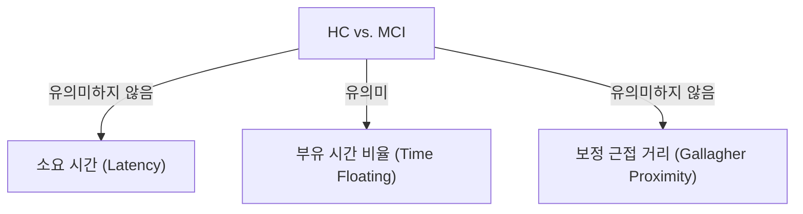
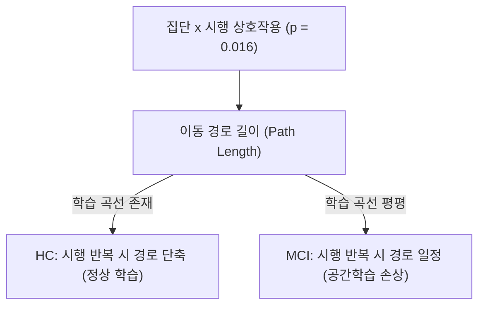
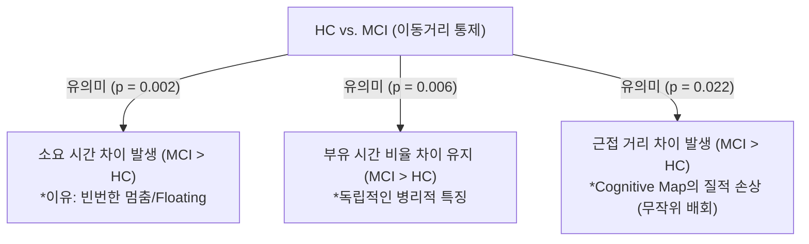

# vMWM Regular Trial: MCI vs. HC 구별 특징 분석 보고서

본 보고서는 가상 모리스 수중 미로(vMWM) 실험의 **Regular Trial(플랫폼을 찾으면 종료되는 실험)**
에서 정상 대조군(HC)과 경도인지장애 환자군(MCI) 간에 나타나는 통계적 및 임상적 차이를 분석하고 요약한 것입니다.

특히 정상 대조군(HC) 수의 증가($n = 64 \rightarrow n = 73$)에 따른 데이터셋 변화와, 행동 지표 간의 상관관계를 통제하기 위해 **이동 경로 길이(Path Length)를 공변량으로 통제(보정)한 분석 결과**를 중점적으로 다룹니다.

---

## 1. 분석 배경 및 핵심 요약

정상 대조군(HC) 군의 추가 모집에 따라 단순 비교 시 기존에 유의했던 변수들의 유의성이 변화하는 현상이 관찰되었습니다. vMWM의 주요 행동 지표들(소요 시간, 부유 시간, 근접 거리 등)은 물리적으로 이동 경로 길이(Path Length)와 매우 강한 상관관계를 보입니다. 

따라서 **경로 길이의 영향을 통제(보정)한 상태에서 각 그룹 간의 순수한 인지적 차이를 재검증**하였으며, 그 결과 세 가지 핵심 지표에서 MCI와 HC 간의 매우 뚜렷하고 독립적인 병리적 차이를 발견했습니다.

> [!IMPORTANT]
> **핵심 발견 (Path Length 통제 후)**
> 1. **학습 패턴의 차이**: HC는 반복 시행을 통해 경로가 급격히 단축되는 정상적인 학습 곡선을 보이나, MCI는 반복 시행에도 경로 길이에 변화가 없이 평평하여 **공간 학습 장애**를 나타냅니다.
> 2. **이동 효율성 저하**: 동일한 거리를 이동할 때 MCI 환자는 빈번하게 멈추어 **부유 행동(Floating)**
을 보이며, 이로 인해 소요 시간(Latency)이 유의미하게 깁니다.
> 3. **인지 지도(Cognitive Map) 손상**: 동일한 거리를 이동하더라도 MCI 환자는 플랫폼으로 수렴하지 못하고 무작위로 분산 배회하여 **플랫폼과의 평균 근접 거리(Proximity)**
가 유의미하게 멉니다.

---

## 2. 주요 행동 지표 비교 분석 (Path Length 보정 전 vs 후)

연령, 성별, 교육 수준 및 **이동 경로 길이(Path Length)** 통제 여부에 따른 각 지표의 집단 효과(Group p-value) 요약입니다.

| 평가 지표 (Outcome) | 보정 전 집단 효과 ($p$) | 보정 후 집단 효과 ($p$) | 통계적 유의성 변화 및 임상적 해석 |
| :--- | :---: | :---: | :--- |
| **소요 시간  (Latency, s)** | 0.142 | **0.002**  *(유의함)* | **[비유의 $\rightarrow$ 유의]** 동일 거리를 이동하더라도 MCI 환자가 더 많은 시간을 소요함. 이동 과정 중 빈번하게 멈추는 부유 행동(Floating)이 원인임. |
| **이동 경로 길이  (Path length, m)** | 0.157 | *N/A* | **[집단 주효과 비유의 / 상호작용 유의 ($p=0.016$)]** 전체 시행 평균 경로는 차이가 없으나, 시행 반복에 따른 단축 패턴(기울기)에서 HC와 MCI 간 뚜렷한 차이가 존재함. |
| **부유 시간 비율  (Time floating, %)** | **0.003**  *(유의함)* | **0.006**  *(유의함)* | **[유의성 유지]** 경로 길이와의 높은 상관관계(r = -0.55)를 배제하더라도, MCI 환자의 부유 행동은 경로 길이와 무관하게 나타나는 독자적 특징임. |
| **보정 근접 거리  (Gallagher proximity, m)** | 0.119 | **0.022**  *(유의함)* | **[비유의 $\rightarrow$ 유의]** 동일한 총 거리를 이동했을 때 MCI 환자가 플랫폼에서 더 먼 영역을 무작위 배회함. 이는 인지 지도(Cognitive Map)의 질적 손상을 시사함. |
| **평균 속도  (Active speed, m/s)** | 0.807 | 0.846 | 두 집단 간 유의미한 속도 차이는 존재하지 않음. 즉, 운동 능력 자체의 저하 보다는 탐색 전략의 차이가 존재함. |
| **목표 사분면 체류 비율  (Time in target quadrant, %)** | 0.345 | 0.221 | 목표 사분면 내 단순 체류 시간 비율은 두 집단 간에 유의미한 차이를 보이지 않음. |

---

## 3. 분석 유형별 요약 관계도

### ① 기본 분석 (Path Length 미보정)

### ② 상호작용 효과 (Path Length 변화 추이)

### ③ 통제 분석 (Path Length 보정 후)

---

## 4. 세부 지표별 구별 특징 및 해석

### 1) 이동 경로 길이 (Path Length) & 학습 곡선 (Learning Curve)
- **통계 결과**: 집단 주효과(Group main effect)는 비유의미($p = 0.157$)하나, **집단 × 시행 상호작용(Group × Trial Interaction) 효과는 유의미($p = 0.016$)**
합니다.
- **임상적 의미**: 
  - **HC**: Trial 1 (3.2m) $\rightarrow$ Trial 2 (2.9m) $\rightarrow$ Trial 3 (1.9m)로 진행될수록 경로의 길이가 뚜렷하게 짧아집니다. 이는 정상적인 공간 정보 습득과 최적 경로 탐색 과정을 보여줍니다.
  - **MCI**: Trial 1 (2.8m) $\rightarrow$ Trial 2 (2.7m) $\rightarrow$ Trial 3 (2.5m) $\rightarrow$ Trial 4 (2.6m)로, 시행이 반복되어도 경로 길이에 거의 변화가 없으며 평평한 수준을 유지합니다. 이는 **공간적 반복 노출에 따른 학습이 원활히 이루어지지 않고 있음**을 나타냅니다.

### 2) 소요 시간 (Latency)
- **통계 결과**: 경로 길이를 통제하지 않았을 때는 차이가 없었으나($p = 0.142$), **경로 길이를 통제하자 집단 간 차이가 유의해졌습니다 ($p = 0.002$)**.
- **임상적 의미**: "동일한 거리를 이동한다고 가정할 때, MCI 군이 HC 군에 비해 훨씬 많은 시간을 소요한다"는 것을 뜻합니다. 이는 MCI 환자가 이동 중 방향을 잃거나 판단이 흐려져 **자주 멈추고 제자리에 떠 있는 행동(Floating)**
을 보이기 때문입니다.

### 3) 부유 시간 비율 (Time Floating %)
- **통계 결과**: 경로 보정 전($p = 0.003$)과 보정 후($p = 0.006$) **모두 유의미한 집단 차이**를 보였습니다.
- **임상적 의미**: 부유 행동은 경로 길이와 통계적으로 음의 상관관계($r = -0.55$)를 보이지만, 그 교란 효과를 통계적으로 완벽히 제거하더라도 여전히 MCI 환자에게서 독자적으로 많이 관찰되는 강력한 병리적 특징입니다.

### 4) 보정 근접 거리 (Corrected Gallagher Proximity)
- **통계 결과**: 경로 보정 전에는 차이가 없었으나($p = 0.119$), **경로 길이를 통제하자 집단 간 차이가 유의해졌습니다 ($p = 0.022$)**.
- **임상적 의미**: 
  - 동일한 총 거리를 이동하더라도, MCI 군은 플랫폼 주변에서 탐색을 집중하지 못하고 플랫폼으로부터 먼 지역을 무작위로 방황했음을 의미합니다.
  - 이는 **Cognitive Map(뇌 내 인지 지도)의 질적 손상을 시사하는 가장 직접적인 증거**입니다. 정상인은 대략적인 위치 정보를 기반으로 타겟을 향해 수렴하며 이동하지만, MCI 환자는 단순 탐색 거리만 채울 뿐 타겟 방향으로의 지향성 없이 분산된 무작위 탐색을 수행하고 있음을 나타냅니다.

---

## 5. 결론 및 향후 분석 방향

이번 분석은 단순 소요 시간이나 경로 길이의 평균 비교로는 드러나지 않던 **MCI 환자의 질적인 탐색 실패 요인**들을 통계적 통제(이동 경로 통제)를 통해 효과적으로 규명했습니다.

1. **상호작용 효과 분석의 중요성**: 집단 간 단순 평균 비교보다는 시행 반복에 따른 경향성 변화(기울기 상호작용)가 MCI 진단에 더 민감한 바이오마커로 작동할 수 있습니다.
2. **분류기(Classifier) 개발 시 특성(Feature) 반영**:
   - 머신러닝/딥러닝 모델 개발 시, 단순 `Latency`나 `Path length` 단일 값보다는 **시행 간 Path Length의 감소율(기울기)** 및 **이동거리 대비 소요시간 비율(이동 효율성)**, **이동거리 대비 근접 거리의 무작위도** 등을 파생 변수(Derived Features)로 설계하여 입력하는 것이 분류 성능 향상에 크게 기여할 것입니다.
